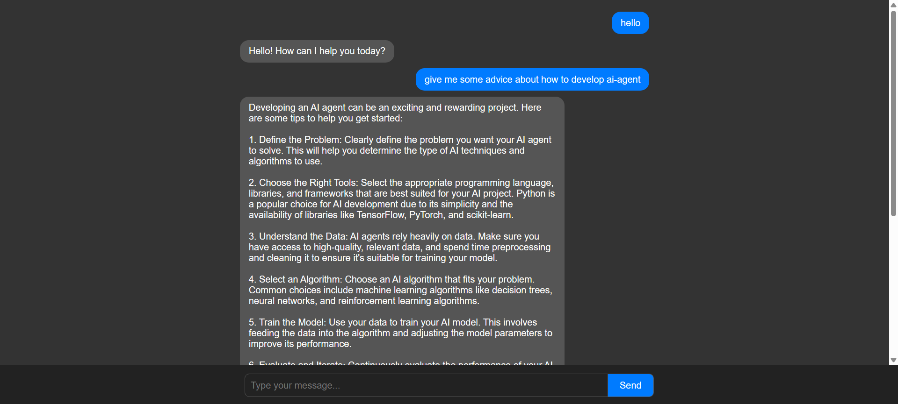

# Frontend

Switch to the frontend directory.Open the cmd and input:

```
npm start
```

then the frontend will launch.

Visit http://localhost:3000


# Backend

Complete the `.env.example` file and rename it to `.env`.

Install Python and run the script.


# Example


